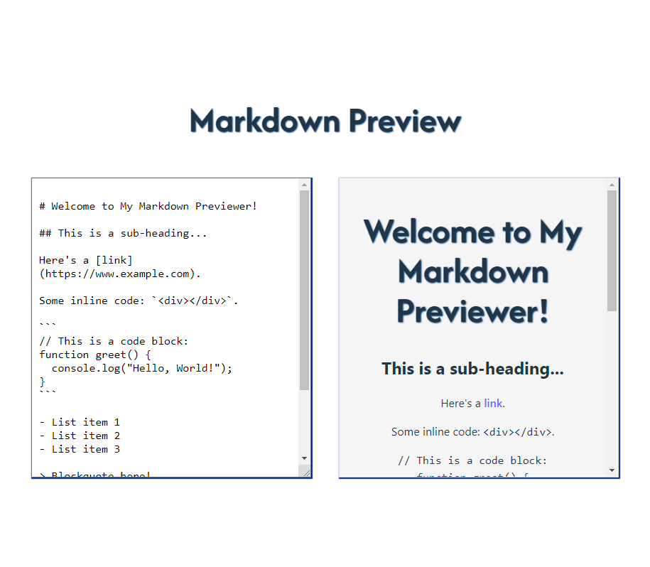

# Markdown Preview

The **Markdown Previewer** is a simple and interactive web application that allows users to write and preview GitHub-flavored markdown in real-time. As you type markdown into the editor, the app automatically updates and displays the corresponding HTML rendering, making it easy to create and format content on the fly.

> live link can be found [here](https://md-previewer-react.vercel.app/)

### Key Features:
- **Real-time Preview:** The preview pane updates instantly as you type markdown, showing the live HTML output.
- **GitHub-Flavored Markdown Support:** The app supports common markdown elements such as headings, lists, links, code blocks, blockquotes, images, and more.
- **User-Friendly Interface:** A split view with a text editor on the left and a live preview on the right ensures a smooth user experience.
- **Pre-loaded with Sample Markdown:** When the app loads, it comes with default markdown content to demonstrate various markdown features such as headings, inline code, blockquotes, and images.
- **Automatic Line Break Handling:** Newlines in your markdown are automatically converted to ` ` elements in the preview.

This tool is perfect for developers, writers, and content creators who need a quick and easy way to see how their markdown will look when converted to HTML.

## Screenshots

